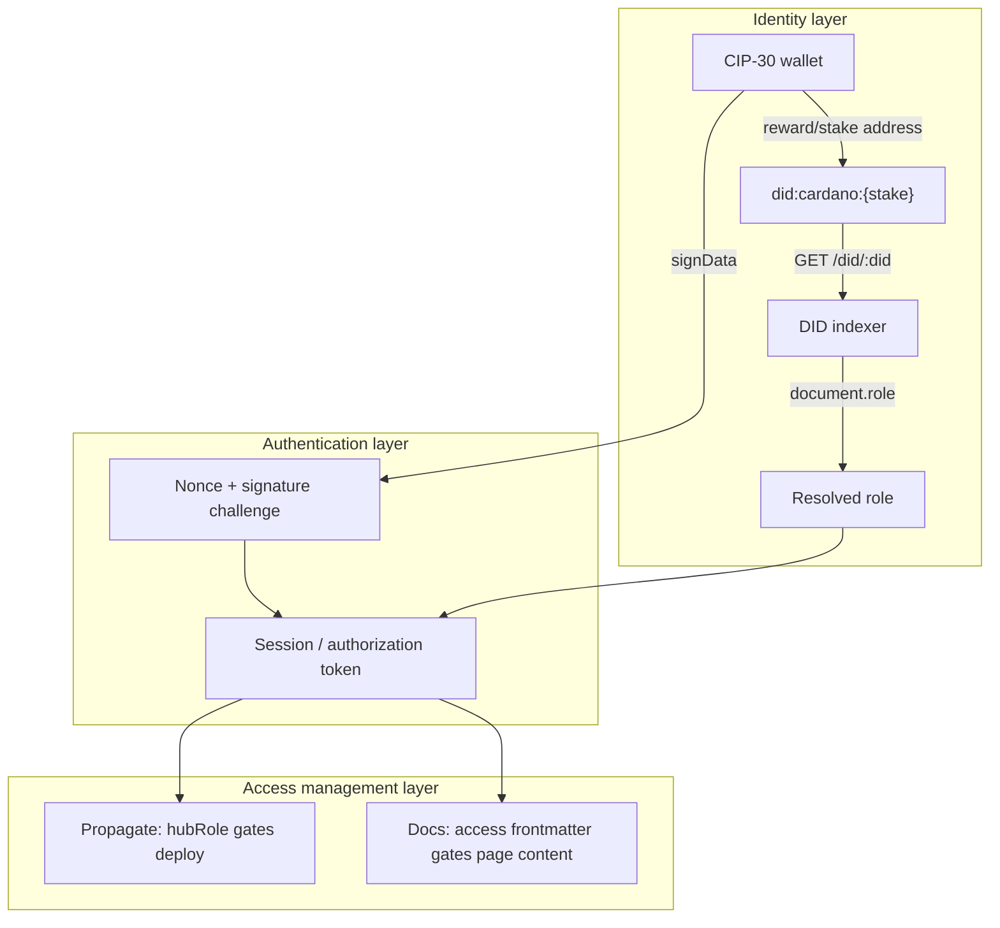
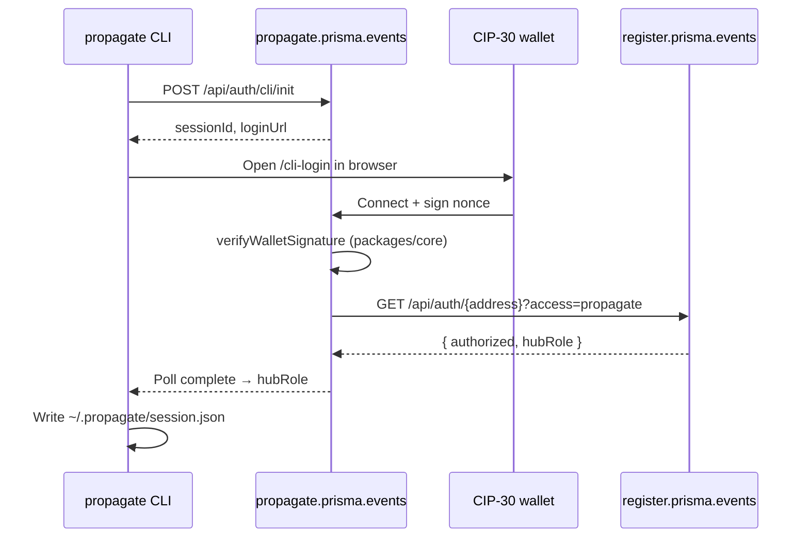
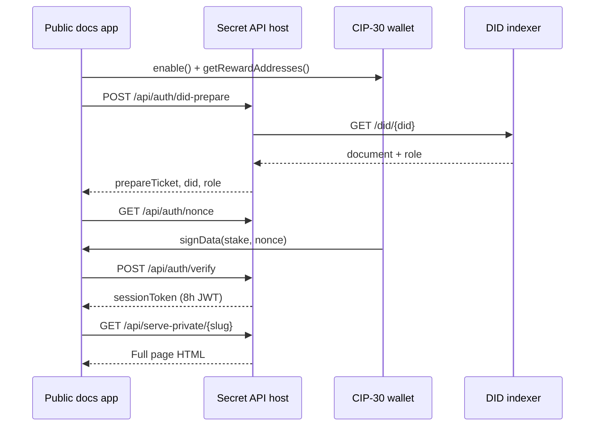

**Version:** 1.0 
**Date:** July 2026 
**Status:** Pilot in progress

## Executive summary

This report documents two production-adjacent pilot implementations that exercise the Prisma DIDs stack for **role issuance, authentication, and access management**. Both pilots converge on the same underlying pattern:

1. A Cardano wallet proves control of a stake key (CIP-30 signature).
2. The stake key is mapped to a `did:cardano:{stakeAddress}` identifier.
3. The **DID indexer** resolves the DID to a document that carries role metadata.
4. The resolved role gates access to a protected resource.

The pilots differ in *what* is protected and *how* roles are scoped:

| Pilot | Repository | Protected resource | Role scope |
|-------|------------|-------------------|------------|
| **Propagate** | `propagate` | Deployment workflow & infrastructure manifests | Hub-level (`OWNER` / `MEMBER`) |
| **Docs** | `docs-secret` | Per-page knowledge in a federated markdown corpus | Event-scoped participant roles (`participant`, …) |

Together they validate the DID indexer as the shared resolution layer for identity-backed authorization across federated Prisma infrastructure.

## Unified architecture

Both pilots implement the same overarching DIDs use case: **roles issuance, authentication, and access management**.



### Shared primitives

| Primitive | Description |
|-----------|-------------|
| **DID method** | `did:cardano:{bech32StakeAddress}` — derived from the wallet reward/stake address |
| **DID indexer** | Fast REST resolver (`GET /did/:did`) indexing on-chain L_DID (199674) metadata events; returns the current DID Document |
| **Wallet proof** | CIP-30 `signData` over a server-issued nonce, verified with Mesh SDK `checkSignature` |
| **Role source** | Indexer-resolved DID Document fields (`role`) or hub-specific mapping (Propagate V1) |
| **Role issuance** | Per-event enrolment via `register.prisma.events` (enrol app); roles are issued in the context of in-person Action Learning Journey events, not as generic platform accounts |

The enrol app (`enrol`, deployed at **register.prisma.events**) is the registration and role-enrolment surface. Its `src/lib/securedid/secureDIDCheck.ts` utility already queries the indexer to confirm an active on-chain DID, and `src/lib/auth/did-lookup.ts` defines the planned wallet → DID → role resolution path consumed by downstream auth APIs.

## The DID indexer as the required implementation

The indexer is the **single source of truth** for DID resolution in both pilots. Consumer applications do not scan the chain directly; they call the indexer REST API.

### Resolution contract

```
GET {INDEXER_URL}/did/{did}?includeUnconfirmed=true
```

| Status | Meaning |
|--------|---------|
| `200` | Active DID — document returned |
| `404` | No registered DID |
| `410` | DID revoked |

Role metadata is read from the resolved document:

```json
{
  "did": "did:cardano:stake1u9...",
  "document": {
    "@context": ["https://www.w3.org/ns/did/v1"],
    "id": "did:cardano:stake1u9...",
    "role": "participant"
  }
}
```

## Pilot 1: Propagate — DID-authenticated deployment workflow

**Repository:** `propagate`  
**Auth app:** `packages/web` → **propagate.prisma.events**  
**Role registry:** **register.prisma.events** (`enrol`)  
**CLI packages:** `packages/cli`, `packages/core`

### Use case

Propagate is a CLI-driven infrastructure provisioner. Operators deploy federated app stacks (docs, timelining, enrol, …) to GitHub + Vercel + Railway from declarative manifests. **Only wallets with an authorized hub role may initiate deployment workflows.**

Each deployment step is more than infrastructure provisioning: it includes a **self-enclosed contract**, sealed at the moment of deployment, between **Prisma** (the source entity) and the **partner hub** (the federated node receiving the app stack). The contract terms — today presented as a T&Cs acceptance step whose contents are served by the Docs app, resembling a software licence agreement — carry legal weight. Unlike a passive checkbox, the act of deployment leaves a **material, tangible footprint** in the real world: a named stack, bound providers, and a declared app graph for a specific client and event. That is why anchoring the deployment manifest on-chain is the natural next step: the chain record becomes the durable seal on a bilateral agreement, not merely an audit log.

The deployment manifest — principally `stack.yaml` plus per-app `app.manifest.yaml` files resolved from the catalog — describes the intended state of infrastructure for a specific event (client, dates, DNS slug, app graph, provider bindings). This manifest is the **canonical artifact** identifying infrastructure state across the federated network. DID-role authorization establishes *who* may initiate and seal that state today; on-chain anchoring (future) makes the sealed contract immutable and independently verifiable.

This pattern is already exercised at scale. During **CATS** (a Cardano-funded event), [45 app deployments](https://case.prisma.events/executive) were made through Propagate — each one a concrete hub-level deployment with real infrastructure and contractual acceptance. Binding authorization to **DIDs** (`did:cardano:{stake}`) rather than opaque wallet allowlists makes that footprint more **secure and decentralised**: roles resolve from the shared indexer, signatures prove control of the stake key, and no single enrol host need be the sole arbiter of who may seal a contract on behalf of a hub.

Example stack metadata:

```yaml
apiVersion: propagate/v1
kind: Stack
metadata:
  clientName: Acme Corp
  eventName: Argentina ALJ
  eventDateStart: "2026-02-11"
  eventDateEnd: "2026-02-13"
deployment:
  slug: acme-corp
dns:
  eventCode: argentina-alj
apps:
  - slug: docs
  - slug: timelining
```

### Authentication flow



#### Code paths

| Layer | Location | Responsibility |
|-------|----------|----------------|
| CLI login orchestration | `packages/cli/src/auth/remote-login.ts` | Session init, browser open, poll loop |
| CLI session persistence | `packages/cli/src/commands/login.ts` | Writes `{ address, hubRole, loggedInAt }` to session file |
| Signature verification | `packages/core/src/auth.ts` | `generateLoginNonce`, `verifyWalletSignature` via Mesh SDK |
| Web verify endpoint | `packages/web/src/app/api/auth/verify/route.ts` | Validates signature, calls enrol auth API |
| Enrol authorization | `enrol/src/app/api/auth/[address]/route.ts` | Returns `hubRole` for authorized wallets |
| Hub auth client | `packages/web/src/lib/register-auth.ts` | `fetchHubAuth` → `REGISTER_API_URL/api/auth/{address}` |

#### Hub roles

Propagate uses a coarse **hub access model**:

| Role | Intended capability |
|------|---------------------|
| `OWNER` | Full stack lifecycle (create, apply, destroy) |
| `MEMBER` | Constrained operator access |

### Implications: manifest as federated state artifact

Propagate treats the resolved stack as authoritative infrastructure intent:

- **`stack.yaml`** — event-scoped deployment descriptor (DNS, providers, app list)
- **`app.manifest.yaml`** — per-app capability graph (requires/provides, deploy workflow)
- **`.propagate/resolved.json`** — validated resolution output after capability graph resolution

Because login binds an operator wallet to a hub role before any `apply` / `destroy` action, the manifest chain becomes an auditable expression of *who* authorized *what* infrastructure state for *which* event. Writing the manifest on-chain (future) closes the loop: DID-role auth today, immutable manifest anchor tomorrow.

### Provider auth (orthogonal to DIDs)

After wallet login, Propagate performs separate OAuth/App-install flows for GitHub, Vercel, Upstash, and Railway (`propagate auth *`). These are **provider credentials**, not identity roles - they delegate cloud API access to the authorized operator session.

## Pilot 2: Docs — hybrid time- and role-scoped knowledge access

**Repository:** `docs-secret`  
**Public artifact:** exported docs app (shell-only for private pages)  

### Use case

The docs app is a **hyperlink markdown repository** representing networked knowledge across [a federated hub network](/en/context-narrative/decks/2026/15). Content lives under `content/` as MDX pages with YAML frontmatter.

Roles are issued **per event** ([action-learning journeys](/en/patterns/action-learning%20journeys)). This gives the living document corpus another level of dynamism: the publisher selects, at page granularity, which information is accessible to whom, which also means for which event.

This is distinct from Propagate's hub-operator model — here roles gate **read access to knowledge**, not **write access to infrastructure**.

### Content boundary model

Private pages are declared in frontmatter:

```yaml
---
private: true
access: participant   # optional; defaults to participant
---
```

Centralized parsing in `lib/content-access.ts`:

- `private: true` → page requires authentication
- `access` → minimum role required (defaults to `participant`)

Private pages are excluded from public indexes at snapshot build time.

### Split deployment architecture

| Layer | Public docs app | Secret API host |
|-------|-----------------|-----------------|
| Page content | `PrivatePageShell` MDX stub only | Full markdown/MDX |
| Auth APIs | Stripped at export | `/api/auth/*` |
| Content API | `/api/serve` → 404 or locked stub | `/api/serve-private` → full HTML |

Export logic (`scripts/public-artifact/export.ts`) replaces private page bodies with shells and removes auth routes from the public artifact. The `access` key is stripped from exported frontmatter so required roles are not exposed on the public host.

### Authentication flow



#### Code paths

| Layer | Location | Responsibility |
|-------|----------|----------------|
| Wallet UX | `contexts/AuthContext.tsx` | CIP-30 connect, nonce, verify, session storage |
| Client gate | `components/PrivatePageShell.tsx` | Lock prompts, fetch private content |
| DID + role prepare | `app/api/auth/did-prepare/route.ts` | Stake → DID → indexer → HMAC prepare ticket |
| Signature verify | `app/api/auth/verify/route.ts` | Ticket + nonce + signature → session JWT |
| Content serve | `app/api/serve-private/[...path]/route.ts` | Infra token + session token → HTML |
| Frontmatter rules | `lib/content-access.ts` | `requiredRoleFromFrontmatter()` |

Session JWT embeds `{ address, did, role }` (`lib/private-auth.ts`). Two credentials protect the private API:

1. **Infra Bearer token** (`PRIVATE_API_TOKEN`) — app-to-app trust between public shell and secret host
2. **Session JWT** (`X-Session-Token`) — wallet-authenticated user identity + role

### Role semantics in docs

| Concept | Source |
|---------|--------|
| **Issued role** | Enrolment / DID indexer (`role` on DID Document) |
| **Required role** | Page frontmatter `access` field |
| **Default** | `participant` when `private: true` and no `access` set |

Roles like `participant` reflect **event-scoped enrolment**, not platform-wide RBAC. A wallet's role may differ across events. Enrolment records and DID document updates reflect cohort participation.

### Time dimension

While role scoping is fully wired through the auth flow, the **time dimension** is implicit in the event-scoped enrolment model:

- Roles are issued for specific in-person event cohorts (ALJ intensives with start/end dates).
- Knowledge pages tied to an event inherit that temporal boundary through enrolment lifecycle (issue at event, potentially revoke or supersede after).
- Session tokens expire after **8 hours**, requiring re-authentication — a short-lived access window layered on longer-lived role credentials.

Full temporal policy (e.g. auto-lock pages after `eventDateEnd`) is a natural extension; the frontmatter + enrolment model provides the hooks.

## Comparative view

| Dimension | Propagate | Docs |
|-----------|-----------|------|
| **Action gated** | Deploy / destroy infrastructure | Read private documentation |
| **Role granularity** | Hub-level (`OWNER`, `MEMBER`) | Page-level (`participant`, …) |
| **Role scope** | Operator / infrastructure team | Event participant |
| **Manifest / content artifact** | `stack.yaml` + app manifests | MDX pages + frontmatter |
| **Auth entrypoint** | CLI → browser login | In-browser wallet connect |
| **Indexer integration** | Planned via enrol `did-lookup` | Live in `did-prepare` |
| **Session form** | CLI poll session + local JSON | 8h JWT in `sessionStorage` |
| **Future anchor** | On-chain manifest | Living document with dynamic boundaries |

Despite these differences, both pilots exercise the same DIDs pipeline: **wallet → DID → indexer → role → access decision**.

## Conclusions

The Propagate and Docs pilots demonstrate that Prisma DIDs are not a single-application feature but a **cross-cutting authorization substrate** for federated infrastructure and knowledge:

1. **Role issuance** happens through event-scoped enrolment (register.prisma.events), producing on-chain DIDs with role metadata indexed by the DID indexer.
2. **Authentication** is wallet-native: CIP-30 signatures prove stake-key control without passwords or centralized identity providers.
3. **Access management** applies resolved roles to protect qualitatively different resources — deployment manifests vs. documentation pages — using the same indexer resolution contract.

The DID indexer is the implementation centerpiece required for this report: both pilots depend on fast, reliable `GET /did/:did` resolution to bridge on-chain identity state to application-level authorization decisions.

Propagate establishes the **infrastructure sovereignty** angle: only authorized hub operators may declare and apply federated stack state. Docs establishes the **knowledge sovereignty** angle: publishers control public/private boundaries at page granularity for event-scoped audiences. Together they validate the Prisma DIDs model as a practical foundation for roles, authentication, and access management across a distributed network.