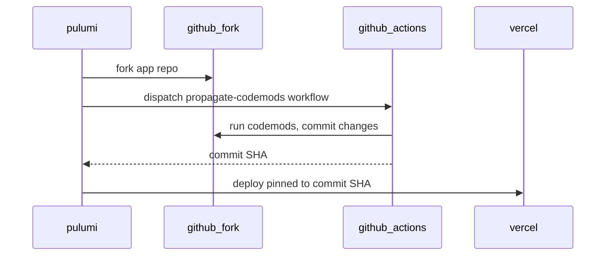

# Deploy codemods

Some apps need **repo-level changes after fork and before Vercel deploy** — for example, throttling cron schedules to satisfy Vercel Hobby plan limits, or applying brand customizations from stack metadata. Propagate handles this with **app-owned codemods** run via GitHub Actions on the forked repo.

Apps without a `deploy.workflow` in `app.manifest.yaml` are deployed unchanged from the fork default branch.

## Why codemods exist

Vercel rejects Hobby-tier production deploys when `vercel.json` defines cron intervals shorter than once daily. Timelining's upstream repo uses `*/15` and `*/30` schedules. Rather than hardcoding fixes in propagate, each app ships its own transforms and workflow.

## Repo layout (in the app repository)

```
app.manifest.yaml                           # deploy.workflow + deploy.codemods (repo root)
propagate/
  workflow.yml                              # canonical workflow spec
  codemods/*.mjs                            # app-owned transforms
  scripts/run-workflow.mjs                  # workflow entrypoint
.github/workflows/propagate-codemods.yml    # GitHub shim (sync from propagate/workflow.yml)
```

### `app.manifest.yaml` deploy block

```yaml
deploy:
  workflow: propagate-codemods
  codemods:
    - propagate/codemods/01-hobby-cron.mjs
```

- `workflow` — stem of the workflow file under `.github/workflows/` (without `.yml`)
- `codemods` — paths relative to the app repo root

`propagate validate` warns if codemods are declared but the workflow file or codemod scripts are missing.

## Apply-time sequence

For each app with `deploy.workflow`:

1. **Fork** upstream repo into target org (`GitHubFork`)
2. **Dispatch** the codemods workflow on the fork via GitHub Actions API (`GitHubWorkflowRun`)
3. **Wait** for the workflow to complete and produce a commit (message prefix `propagate:`)
4. **Deploy to Vercel** pinned to the resulting commit SHA (`VercelDeploy`)

Apps without `deploy.workflow` go directly from fork to Vercel on the default branch.



## Vercel plan and cron throttling

Timelining's hobby cron codemod reads `vercel_plan` from workflow inputs. The value comes from `stack.yaml`:

```yaml
provider:
  vercel:
    teamId: team_xxx
    plan: hobby   # hobby | pro — default hobby
```

| Plan | Timelining cron behaviour |
|------|---------------------------|
| `hobby` (default) | Cron schedules throttled to once daily |
| `pro` | Upstream `vercel.json` intervals preserved |

## GitHub App permissions

The Propagate GitHub App on the target org needs:

| Permission | Purpose |
|------------|---------|
| **Administration: Read and write** | Fork and delete repositories |
| **Actions: Read and write** | Dispatch codemods workflow on forks |

The workflow commits using its own scoped `GITHUB_TOKEN` inside GitHub Actions — propagate does **not** need `contents: write` on forks.

## Idempotency and re-runs

On re-apply, propagate detects forks that already have a `propagate:` customization commit and **skips** re-dispatching the workflow. If you need to re-run codemods, delete the customization commit on the fork or use `propagate repair` to identify forks missing customization.

## Partial-stack recovery

If `propagate destroy` removed Vercel resources from Pulumi state but GitHub forks remain:

```bash
propagate repair    # report drift: forks without Vercel, forks missing codemod commit
propagate apply     # recreate Vercel projects; re-dispatch workflow only when needed
```

See [CLI reference](/processes/process-infrastructuring/propagate/cli) for `propagate repair`.

## Related

- [Workflow](/processes/process-infrastructuring/propagate/workflow) — full apply sequence including codemods
- [Manifests](/processes/process-infrastructuring/propagate/manifests) — `deploy` block and `provider.vercel.plan`
- [Forking](/processes/process-infrastructuring/propagate/forking) — GitHub App permissions
