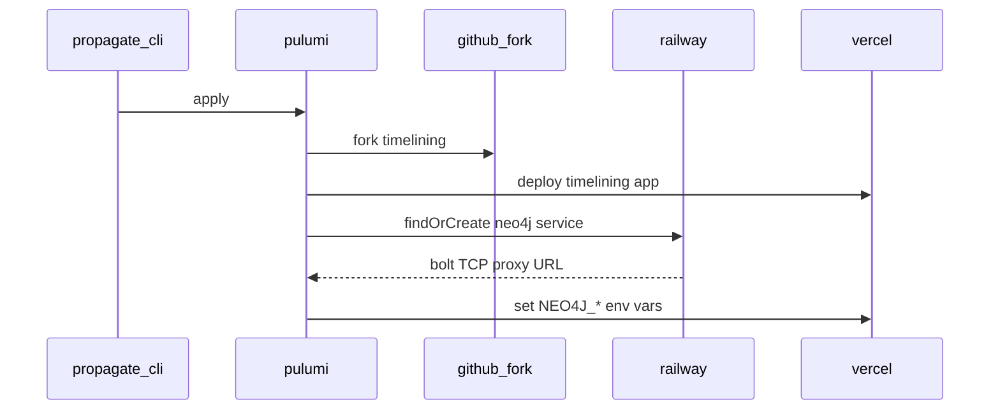

# Neo4j provisioning (timelining)

Timelining stores graph data (entries, embeddings, visualise APIs) in **Neo4j Community Edition**, hosted on **Railway**. Propagate provisions Neo4j automatically during `propagate apply` unless you override credentials in `.propagate/values.yaml`.

## Why Neo4j on Railway?

Timelining runs on Vercel (serverless). Neo4j requires a persistent database with Bolt protocol access. Railway hosts the database as a separate service, built from the timelining repo's `.docker/` directory, with a **TCP proxy** so Vercel can connect over `bolt://`.

## Default operator flow

1. **`propagate create`** — no Neo4j prompts. Info log states Neo4j will be provisioned on apply.
2. **`propagate auth railway`** — one-time browser wizard on [propagate.prisma.events](https://propagate.prisma.events):
   - Install the [Railway GitHub App](https://github.com/apps/railway-app/installations/new) on the target org (same org as `stack.yaml` → `provider.github.targetOrg`)
   - Create and paste a Railway **account** API token (see token requirements below)
   - CLI stores `railwayToken` and `railwayConnection` in `.propagate/credentials.json`

For CI or headless use, set `RAILWAY_API_TOKEN` in the environment instead of running the wizard.

### Railway API token requirements

Create the token at [railway.com/account/tokens](https://railway.com/account/tokens) with **"No workspace"** selected in the scope dropdown.

| Token scope | Works with propagate? |
|-------------|----------------------|
| **No workspace** (account token) | Yes — required for `{ me }` probe and project listing |
| Workspace-scoped token | No — returns "Not Authorized" on GraphQL probe |

Propagate sends `Authorization: Bearer <token>` to `https://backboard.railway.com/graphql/v2`. Project tokens (`RAILWAY_TOKEN` from `railway link`) use a different header and are not supported.

Verify your token:

```bash
curl -X POST https://backboard.railway.com/graphql/v2 \
  -H "Authorization: Bearer YOUR_TOKEN" \
  -H "Content-Type: application/json" \
  -d "{\"query\":\"query { me { id } }\"}"
```

A successful response includes `"data": { "me": { "id": "..." } }`.

3. **`propagate validate`** — resolves `neo4j.connection` as provisioned; validates `.docker/Dockerfile` exists in the timelining repo.
4. **`propagate apply`** — Pulumi:
   - Forks timelining (includes `.docker/`)
   - Deploys timelining to Vercel
   - Creates or reuses Railway service `{deploymentSlug}-timelining-neo4j`
   - Builds from fork repo `rootDirectory: .docker`
   - Enables TCP proxy on port 7687
   - Injects `NEO4J_URI`, `NEO4J_USERNAME`, `NEO4J_PASSWORD` into the timelining Vercel project



## Docker image location

The Neo4j image definition lives in the **timelining** repo at `.docker/`:

| File | Purpose |
|------|---------|
| `.docker/Dockerfile` | Extends `neo4j:5-community` with timelining config |
| `.docker/neo4j.conf` | Bolt, memory, vector index settings |

The timelining `app.manifest.yaml` declares:

```yaml
- id: neo4j.connection
  source: provisioned
  provisioner: railway.neo4j
  dockerPath: .docker
```

## Override with your own Neo4j

Add to `.propagate/values.yaml` to skip Railway provisioning:

```yaml
capabilities:
  neo4j.connection:
    NEO4J_URI: bolt://your-host:7687
    NEO4J_USERNAME: neo4j
    NEO4J_PASSWORD: your-password
```

Re-run `propagate validate` before apply.

## Existing Railway instance

If `propagate apply` detects an existing timelining or Neo4j service in your Railway account (and no `neo4j.connection` override in values), the CLI prompts for `NEO4J_URI`, `NEO4J_USERNAME`, and `NEO4J_PASSWORD` — the same manual workflow as before auto-provisioning.

## Idempotency

- Railway service name: `{deploymentSlug}-timelining-neo4j`
- Railway project name (if not set in stack): `{deploymentSlug}-propagate`
- Re-running `propagate apply` reuses the same Pulumi-managed service; it does not create duplicate instances.

Optional: set `provider.railway.projectId` or `provider.railway.workspaceId` in `stack.yaml` to target a specific Railway project or workspace.

## Troubleshooting

| Issue | Remedy |
|-------|--------|
| `RAILWAY_API_TOKEN is required` | Run `propagate auth railway` |
| `Not Authorized` on Railway probe | Create token with **No workspace** at railway.com/account/tokens; unset shell `RAILWAY_TOKEN` if set |
| Railway build fails | Run `propagate auth railway` to install Railway GitHub App on target org; ensure fork contains `.docker/Dockerfile` |
| GitHub source not connected on Railway service | Run `propagate auth railway`, then `propagate apply`; use `propagate repair` to diagnose |
| No TCP proxy / connection timeout | Check Railway service networking → TCP proxy on port 7687 |
| Invalid bolt URI | Use `bolt://host:port` (timelining uses encryption off for Railway proxy) |
| Service exists but credentials unknown | Add `neo4j.connection` to values.yaml or destroy the Railway service |

## Related

- [CLI reference](/processes/process-infrastructuring/propagate/cli) — `propagate auth railway`
- [Environment variables](/processes/process-infrastructuring/propagate/environment-variables) — `RAILWAY_API_TOKEN`, credentials file
- [Manifests](/processes/process-infrastructuring/propagate/manifests) — `provisioned` capability source
