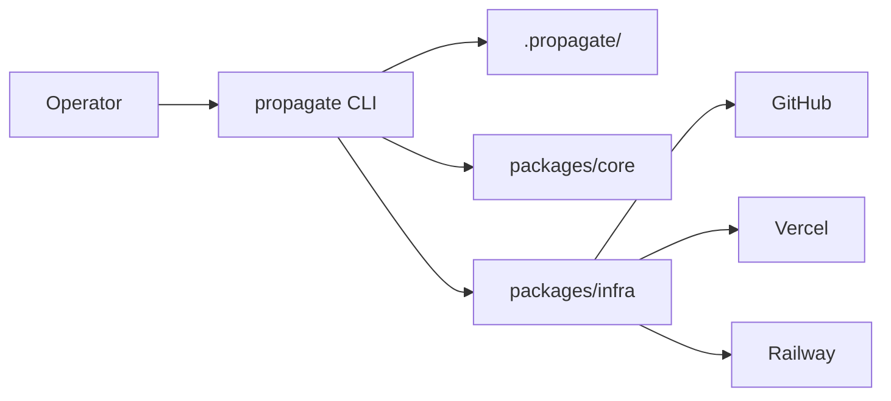

# Deployment workflow

Propagate replaces the former client-orchestrated serverless workflow with a local CLI + Pulumi pipeline.

## Architecture

| Layer | Role |
|-------|------|
| **CLI** | Collects intent, validates, drives Pulumi |
| **Workspace** | `.propagate/` manifests and state on operator machine |
| **Core** | Schema validation, capability resolution, topological sort |
| **Pulumi** | Durable infra: GitHub forks, Vercel projects, Upstash Redis, Railway Neo4j, env vars, domains |



## End-to-end sequence

### 1. Initialise

```
propagate init
```

Creates `.propagate/`, Pulumi state directory, global config template, and gitignore entries.

### 2. Authenticate

```
propagate login
```

Opens browser on [propagate.prisma.events](https://propagate.prisma.events) for Cardano wallet sign-in. Optionally prompts to install the GitHub App if a workspace stack already exists and the app is not yet installed.

### 3. Create manifest

```
propagate create
```

Writes `stack.yaml`, `values.yaml`, and `credentials.json` (GitHub App install + Vercel token).

### 4. Validate and resolve

```
propagate validate
```

1. Parse and validate `stack.yaml`
2. Load `app.manifest.yaml` from each selected app repo
3. Build dependency graph from `dependsOn`
4. Topologically sort → deployment order
5. Resolve capabilities: user values, derivable URLs, generated tokens
6. Verify capability graph is closed (every `requires` has a provider)
7. Write `resolved.json`

Fails with a clear message if `app.manifest.yaml` is missing — run the agent task in propagate `AGENT_PREPARE_APPS.md` first.

### 5. Apply

```
propagate apply --yes
```

1. Ensure GitHub App is installed on target org (prompt if missing)
2. Ensure Vercel connection is complete (OAuth + GitHub App + team integration probe)
3. Ensure Railway is connected when timelining Neo4j is provisioned (`propagate auth railway`)
4. Mint short-lived GitHub installation token from auth server
5. Read `resolved.json`; detect existing forks/projects to skip redundant work
6. Run Pulumi with local file backend (`.propagate/pulumi-state/`)

**Phase A — deploy apps (Redis deferred when timelining needs Upstash):**

Per app in deployment order:

- Fork upstream repo into target GitHub org (or reuse existing fork)
- If `deploy.workflow` is set in `app.manifest.yaml`: dispatch codemods GitHub Actions workflow on the fork, wait for commit
- Create/link Vercel project, inject env vars, assign domain, deploy pinned to codemod commit SHA (or default branch)
- Provision Railway Neo4j for timelining (when not overridden in `values.yaml`)

**Phase B — Redis (timelining only, when `upstash.kv` is not overridden):**

7. Verify Upstash marketplace integration on the Vercel team (`propagate auth upstash` if missing)
8. Second Pulumi pass: create Upstash Redis store, connect to timelining project, trigger follow-up redeploy so `KV_REST_*` env vars are live

9. Snapshot `stack.yaml` to `.propagate/last-applied/`

See [Deploy codemods](/processes/process-infrastructuring/propagate/codemods) for the fork → workflow → Vercel sequence.

### 6. Observe and maintain

```
propagate status    # Pulumi stack outputs
propagate repair    # GitHub/Vercel/Pulumi/Railway drift report
propagate diff      # manifest drift + pulumi preview
propagate destroy   # tear down for testing
```

## Per-app provisioning steps

Each app in the catalog runs provision steps based on its manifest:

```
forkRepo (GitHub) → runCodemodsWorkflow (GitHub Actions, optional) → deployToVercel (Vercel) → provisionManagedServices (Upstash / Railway)
```

Previously these were imperative API actions polled from a Next.js server. They are now Pulumi dynamic resources in `packages/infra`:

- `GitHubFork` — forks via GitHub REST API using a GitHub App installation token (minted at apply time)
- `GitHubWorkflowRun` — dispatches app-owned codemods workflow on the fork; returns commit SHA for Vercel deploy
- `VercelDeploy` — creates project, env vars, domain, and deployment via Vercel REST API (optionally pinned to codemod commit)
- `VercelUpstashKv` — provisions Upstash Redis and connects to the timelining Vercel project (second apply phase)
- `VercelRedeploy` — triggers follow-up git deploy after Redis env vars are injected
- `RailwayNeo4j` — provisions Neo4j Community on Railway from timelining `.docker/` and injects `NEO4J_*` into Vercel

See [Deploy codemods](/processes/process-infrastructuring/propagate/codemods) and [Neo4j provisioning](/processes/process-infrastructuring/propagate/neo4j) for detail.

## Comparison with v1 (web wizard)

| Aspect | v1 (web wizard) | v2 (CLI + Pulumi) |
|--------|-----------------|-------------------|
| Config storage | Zustand (browser memory) | `stack.yaml` on disk |
| Workflow state | In-memory Maps (serverless) | Pulumi state file |
| GitHub fork | PAT service-account invite flow | GitHub App install + installation token |
| Env vars | Timelining hardcoded in UI | Capability-based per `app.manifest.yaml` |
| DNS | Not implemented | `{appSlug}.{eventCode}.{hostName}` |
| App dependencies | None | `dependsOn` + topological sort |
| Auth | Wallet + web session | `propagate login` (hosted browser) |
| GitHub auth | OAuth user token + backend PAT | GitHub App install via `propagate auth github` |

## Event organising context

Events create exceptional circumstances for demonstrations of alternative futures. The publishing stack (docs, timelining, and future apps) gives hubs data-backed accounts of organising processes and intensives.

During event organising, hubs deploy and configure publishing applications. Propagate automates this for authorised operators while preserving data sovereignty — each app runs in the hub's own GitHub org and Vercel team.

Currently offered apps in propagation:

1. **Docs** — static-site documentation with private API for page snapshots and protocol schemas
2. **Timelining** — Telegram bot + graph database for real-time, voice-based contribution accounting

See [Publishing](/processes/process-infrastructuring/publishing) for per-app setup guides.
