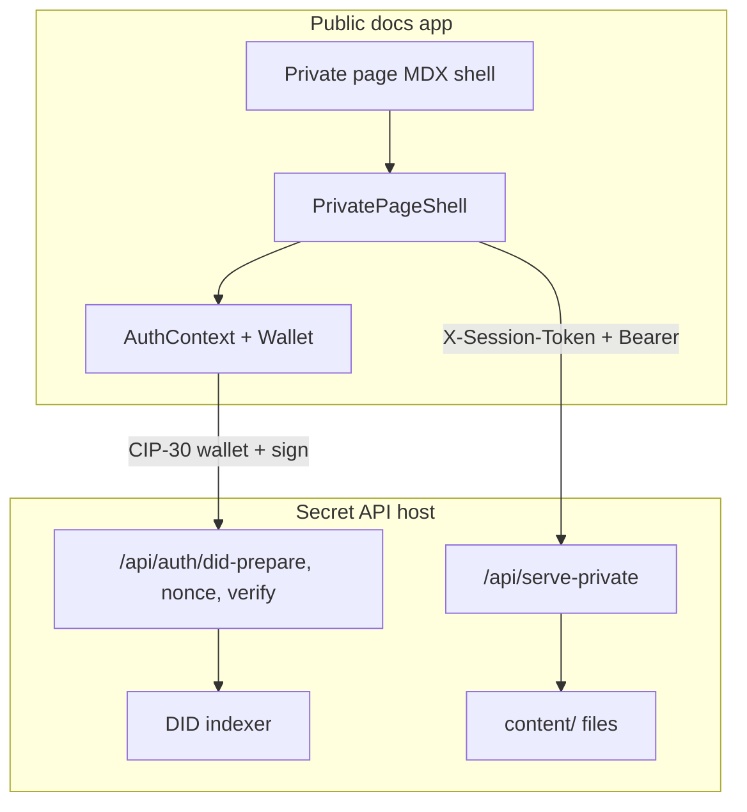

# Public / Private Boundary

How private pages are marked, exported, authenticated via wallet connect, and served across the public docs app and the secret API host.

## Architecture overview

The system uses a **split deployment**:

| Layer | Public docs app | Secret API host (`PRIVATE_DOCS_API_ONLY=true`) |
|-------|-----------------|------------------------------------------------|
| Page content | Shell only | Full markdown/MDX |
| Auth APIs | Removed at export | `/api/auth/*` |
| Content API | `/api/serve` (locked stub / 404) | `/api/serve-private` (full content) |



---

## 1. Marking private pages (content boundary)

Pages are declared private via **frontmatter**:

```yaml
private: true
access: participant   # optional; defaults to general-participant
```

The access rule is centralized in `requiredRoleFromFrontmatter()` (`lib/content-access.ts`):

- If `private` is not `true`, no role is required (public page).
- If `private: true`, the required role is `access` or defaults to `general-participant`.

Private pages are also **excluded from public indexes**: the page snapshot build skips any file with `private: true` frontmatter.

---

## 2. Public vs private content at export time

`scripts/public-artifact/export.ts` is the main public/private split:

- **Public pages** → copied as-is (with private asset refs replaced by `<PrivateAssetNotice />`).
- **Private pages** → body replaced by a shell: a single self-closing MDX component, `PrivatePageShell`, with `slug="/en/context-narrative/litepaper/context"`.

The `access` key is stripped from exported frontmatter so required roles are not exposed on the public artifact. Auth API routes (`serve-private`, `auth/*`) are **removed** from the public export.

On the public host, `/api/serve` enforces the boundary:

- Raw private content → **404**
- Shell sources without `format` → **locked HTML stub** (“sign in with wallet”)

See `app/api/serve/[...path]/route.ts` and `lib/serve-render.ts` (`isPrivatePageShellSource`, `lockedPrivateShellHtmlPage`).

---

## 3. Wallet connect + role-based session

`AuthContext` (`contexts/AuthContext.tsx`) drives the full wallet auth flow using **CIP-30** Cardano wallets (Eternl, Nami, Lace, etc.):

1. **Enable wallet** → `getRewardAddresses()`
2. **`POST /api/auth/did-prepare`** — server converts reward hex → stake bech32, derives `did:cardano:{stake}`, queries the **DID indexer**
3. **Role resolution** from indexer response (`authRole` or `role`, default `participant`) — see `app/api/auth/did-prepare/route.ts`
4. Server issues an **HMAC prepare ticket** binding `{stakeBech32, did, role, network}` (`lib/hmac-ticket.ts`)
5. **`GET /api/auth/nonce`** — stateless HMAC nonce for the stake address
6. Wallet **`signData(stakeBech32, nonce)`** (CIP-30)
7. **`POST /api/auth/verify`** — validates ticket, nonce, signature → issues **8h session JWT** with `{address, did, role}` (`lib/private-auth.ts`)

Session state is stored in `sessionStorage` (`private-docs-session`). Status values:

| Status | Meaning |
|--------|---------|
| `disconnected` | No wallet session |
| `connecting` | Wallet enable in progress |
| `verifying` | Nonce signed, awaiting server verify |
| `verified` | Session JWT issued |
| `no-did` | Wallet connected but indexer has no registered DID |

The navbar wallet control (`NavbarWalletStatus`, `WalletConnectButton`) reads from the same context.

---

## 4. Client-side page gate (`PrivatePageShell`)

On the public docs app, private routes render only the shell. `PrivatePageShell` (`components/PrivatePageShell.tsx`) is the runtime gate:

| Condition | UI |
|-----------|-----|
| Not connected / connecting / verifying | `LockPrompt` — “Connect your wallet” |
| `no-did` | `LockPrompt` — “No DID was found” |
| API returns 403 | `LockPrompt` — “Your role does not grant access” |
| Verified + content loaded | Rendered HTML from secret API |

Once `status === 'verified'`, it fetches real content from the **secret host**:

```
GET {NEXT_PUBLIC_PRIVATE_API_BASE_URL}/api/serve-private/{slug}?format=html
Headers:
  Authorization: Bearer {NEXT_PUBLIC_PRIVATE_API_TOKEN}
  X-Session-Token: {sessionToken}
```

---

## 5. Server-side content serving (`/api/serve-private`)

The private API requires **two credentials**:

1. **Infra Bearer token** (`PRIVATE_API_TOKEN`) — app-to-app trust (`verifyInfraRequest`)
2. **Session JWT** (`X-Session-Token`) — wallet-authenticated user with embedded `role` (`verifySessionToken`)

**Important:** role enforcement against page `access` is **not fully implemented yet**. The route reads `requiredRole` from frontmatter but only logs — it does not compare `session.role` to `requiredRole` or return 403:

```
[serve-private-api] Role verification would happen here
```

So today, **any verified session can fetch any private page** from the API. The `insufficient-role` UI path exists on the client but the server does not yet emit 403.

---

## 6. Roles in practice

Roles come from the **enrolment/DID indexer** (e.g. `participant`, `general-participant`), not from frontmatter alone. Frontmatter `access` declares the **minimum role required** per page. Examples in this repo:

- `access: participant` — strategy docs, litepaper sections
- `access: general-participant` — enrolment contracts, interview guides

There is no role hierarchy/comparison function in the codebase yet — only string assignment and a placeholder for future checks.

---

## 7. Secret repo vs public artifact

In the **secret repo** (`docs-secret`), private pages still contain full MDX (no shell) and render normally via Nextra. The shell + wallet gate pattern applies to the **exported public docs** deployment that points `NEXT_PUBLIC_PRIVATE_API_BASE_URL` at the secret host.

The secret API host runs with `PRIVATE_DOCS_API_ONLY=true`; `proxy.ts` then serves only `/api/*` routes (all other paths return 404).

---

## Summary

| Concern | Mechanism |
|---------|-----------|
| **What is private?** | `private: true` frontmatter |
| **Who can access?** | `access: <role>` (intended; not enforced server-side yet) |
| **Public visibility** | Export replaces body with `PrivatePageShell`; auth APIs stripped |
| **Identity** | Cardano wallet → stake address → `did:cardano:...` via indexer |
| **Authorization** | Indexer returns `authRole`/`role` → session JWT |
| **Runtime gate** | `PrivatePageShell` + `LockPrompt` + fetch to secret `/api/serve-private` |
| **Infra trust** | Shared `PRIVATE_API_TOKEN` between public app and secret API |

## Key source files

| File | Role |
|------|------|
| `lib/content-access.ts` | Frontmatter parsing, `requiredRoleFromFrontmatter` |
| `scripts/public-artifact/export.ts` | Public export, shell generation |
| `app/api/serve/[...path]/route.ts` | Public content API (404 / locked stub) |
| `app/api/serve-private/[...path]/route.ts` | Private content API |
| `contexts/AuthContext.tsx` | Wallet connect + session |
| `app/api/auth/did-prepare/route.ts` | DID resolve + role from indexer |
| `app/api/auth/verify/route.ts` | Signature verify + session JWT |
| `components/PrivatePageShell.tsx` | Client-side gate |
| `components/LockPrompt.tsx` | Denial messages |
| `lib/private-auth.ts` | Session JWT, infra token verify |
| `lib/hmac-ticket.ts` | Nonce + prepare ticket (stateless HMAC) |
