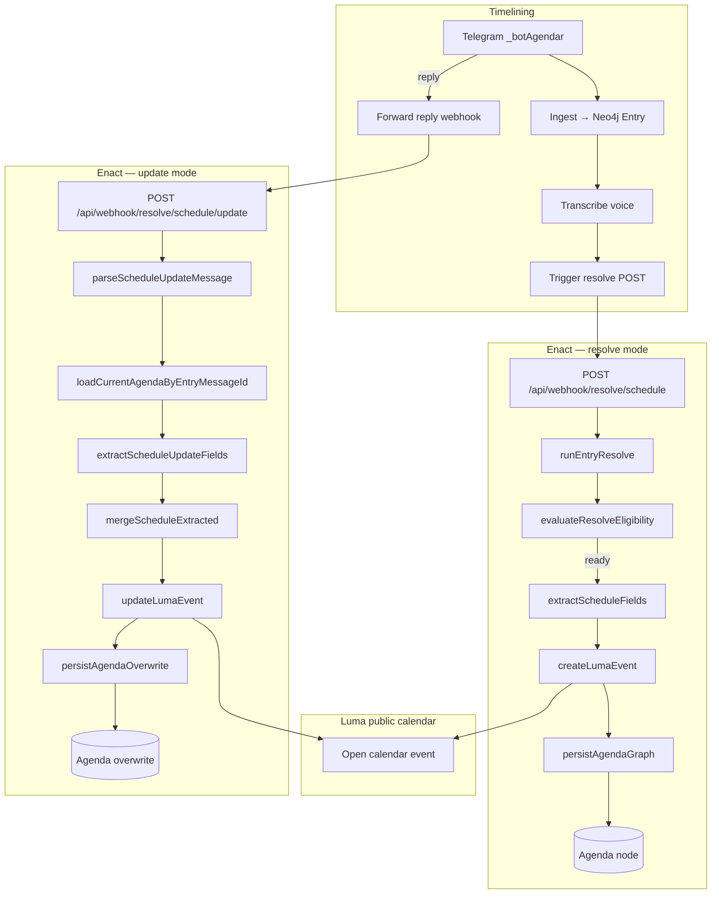

## Enact: Dynamic Scheduling

Repo: [enact](https://github.com/prisma-collective/enact). Topic: `_botAgendar`.

The scheduling resolver turns spoken or typed contributions into **public Luma calendar events**, supporting dynamic, bottom-up agenda formation. It was designed from within self-organising activities of in-person decentralised groups - to maintain coherence in highly adaptive, sometimes informal organisations operating under rapidly changing environmental conditions (emergent contexts).

Participants propose events in natural language on `_botAgendar`. The resolver extracts structured schedule fields against the [schedule protocol](/en/processes/process-infrastructuring/protocols/enaction/schedule/schedule), creates or updates the event on a shared open Luma calendar, and persists an `Agenda` node in Neo4j as a durable record of group coordination. A **default online meeting URL** is applied when no specific link is given; optional fields support physical venues, capacity, visibility, and other event metadata.

Enact also hosts resolve-only handlers for `_botDecidir` and `_botRecursos`; this page documents the scheduling resolver only.

## How it works

A voice note or text message describing an event is ingested by timelining, transcribed when needed, and passed to enact in **resolve mode**. The resolver loads the entry, extracts required fields (`name`, `start_at`, `timezone`), creates a Luma event, and writes an `Agenda` node linked to the entry. Generic virtual mentions ("on Zoom", "online") map to the default meeting link; physical addresses are sent to Luma as `geo_address_json`.

When a participant **replies** to the original message with a correction, timelining forwards the webhook in **update mode** (without re-ingesting). Enact loads the current `Agenda`, extracts optional patch fields, updates the linked Luma event, and records a new `Agenda` version with an `overwriting` relationship — preserving correction history on one live calendar event.

| Mode | Timelining trigger | Enact endpoint |
|------|-------------------|----------------|
| **Resolve** | After ingest / transcribe | `POST /api/webhook/resolve/schedule?entryId=` |
| **Update** | Reply forward (`replies_only`) | `POST /api/webhook/resolve/schedule/update` |

Backlog processing uses `POST /api/webhook/resolve/schedule?backlog=true` to resolve the next pending entry.

## HTTP routes

| Route | Auth | Purpose |
|-------|------|---------|
| `POST /api/webhook/resolve/schedule?entryId={id}` | Infra (`PRIVATE_API_TOKEN`) | Resolve one entry → extract, create Luma event, persist `Agenda` |
| `POST /api/webhook/resolve/schedule?backlog=true` | Infra | Pick next pending `_botAgendar` entry and resolve it |
| `POST /api/webhook/resolve/schedule/update` | Infra | Apply a reply-based correction to an existing agenda and Luma event |

Auth for infra routes: `verifyInfraRequest` in `src/lib/private-auth.ts`.

## Eligibility and graph writes

**Resolve mode** runs when the topic is `_botAgendar` and the entry has voice with ready transcription, or non-empty text content. Voice-only entries skip until transcribed (`voice_not_ready`). Reply messages are not ingested as entries — they arrive via update mode only.

On resolve, enact deletes any existing `Agenda` for the entry (idempotent re-resolve), creates a new node with extracted fields and `lumaEventId`, and links `Agenda -[:FOR_ENTRY]-> Entry`.

On update, enact creates a successor `Agenda` linked to the prior version (`Agenda -[:overwriting]-> Agenda`) and the same entry. The protocol defines a `schedule` node schema; the resolver persists it under the **`Agenda` graph label**.

<SchemaGraphViewer schemaLocation="en/processes/process-infrastructuring/protocols/enaction/schedule/protocol.json" />

## Luma integration

| Concern | Behaviour |
|---------|-----------|
| **Required fields** | `name`, `start_at`, `timezone` — resolve fails if extraction cannot infer them |
| **Default meeting** | Applied when no specific URL is extracted; generic virtual mentions map to the default link |
| **Physical location** | `address` → Luma `geo_address_json`; venue text is never placed in `meeting_url` |
| **Default duration** | `end_at` defaults to one hour after `start_at` when not specified |
| **Default timezone** | `SCHEDULE_DEFAULT_TIMEZONE` env var used when the transcript omits timezone |
| **Partial dates** | Partial ISO forms (e.g. `--06-18T19:30:00`) are resolved against today's date in the stated timezone; stale LLM years are reconciled |

Created events appear on the hub's public Luma calendar, making bottom-up proposals visible for emergent agenda formation.

## Boundary with timelining

| Concern | Owner |
|---------|-------|
| Webhook receipt, Redis backlog, Neo4j `Entry`, transcription, embeddings | **timelining** |
| Topic → sibling routing (`organising.config.ts`) | **timelining** |
| Reply forward to schedule update endpoint | **timelining** (forward `replies_only`) |
| Schema extraction, Luma create/update, `Agenda` writes, resolve backlog | **enact** |

Enact does not create `Entry` nodes or run transcription. Failed resolve sets `resolveStatus: failed` on the entry; timelining cron retries via `POST ?entryId=`.
## Related docs

- [Organising config](/processes/process-infrastructuring/publishing/timelining/organising-config) — `_botAgendar` forward + resolve routing
- [Schedule protocol](/en/processes/process-infrastructuring/protocols/enaction/schedule/schedule) — schema the resolver extracts against
- [Resolvers overview](/processes/process-infrastructuring/publishing/timelining/resolver-examples) — forward vs resolve across siblings

---

## Overall flow

