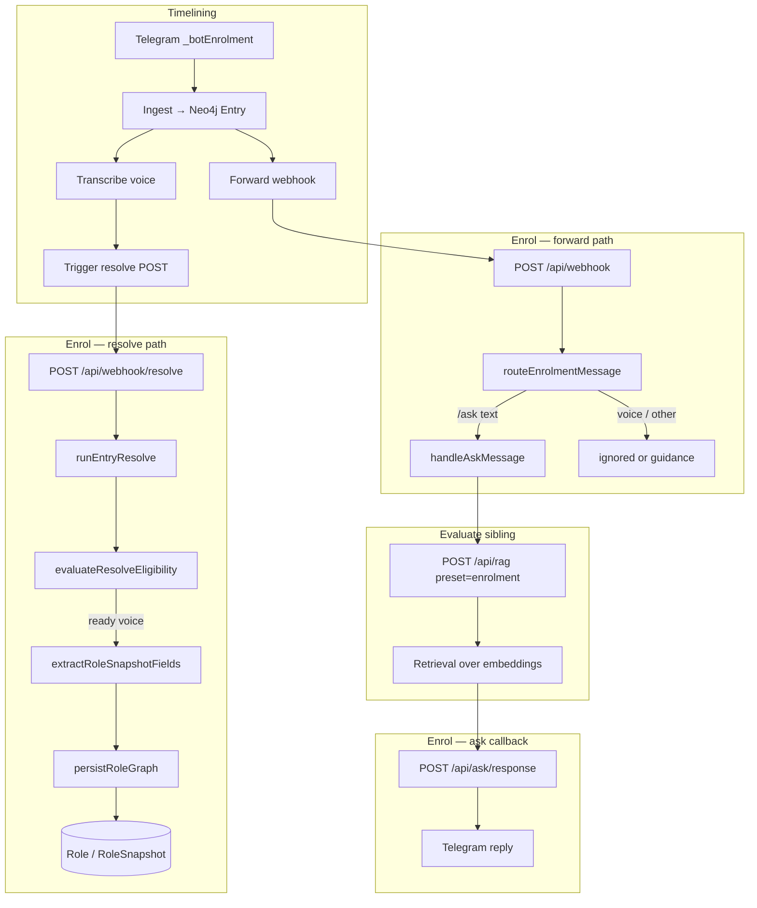

## Enrol: Developmental Enrolment

Repo: [enrol](https://github.com/prisma-collective/enrol) (`register.prisma.events`). Topic: `_botEnrolment`. Neo4j nodes owned: `Role`, `RoleSnapshot`.

The enrol resolver serves two distinct purposes on the same Telegram channel. **Ask** answers onboarding questions in real time by delegating retrieval to the [evaluate](https://github.com/prisma-collective/evaluate) sibling app. **Role snapshot resolve** turns voice reflections into structured graph nodes - iterations of a participant's evolving role clarity during emergent and aligned collective action.

Both paths share timelining's ingest pipeline (Neo4j `Entry` nodes, transcription, embeddings) but diverge at the sibling boundary: forward for live `/ask`, resolve for schema extraction and `Role` / `RoleSnapshot` writes. For the purposes of the enrol *resolver* documentation, the `/ask` path is omitted from this page. 

## Role Snapshot: Reflections on evolving role clarity

Participants send **voice notes** to `_botEnrolment`. Timelining ingests the message, stores an `Entry` in Neo4j, transcribes the audio, and then triggers resolve on enrol.

Resolve treats each eligible voice entry as a **reflection** - a moment of clarity about what someone is holding, intending, or becoming in the collective. The resolver:

1. Loads the entry and its transcription from Neo4j.
2. Fetches the enrolment protocol channel schema from docs (`role_snapshot` node).
3. Extracts structured fields from the transcript via OpenAI.
4. Writes a `RoleSnapshot` linked to a stable `Role` node for that participant.

Each new reflection creates a new snapshot (`ITERATION_OF` the same `Role`), preserving the history of how someone's role understanding develops over time. Downstream apps such as evaluate can retrieve these snapshots alongside other embedded content. 

Text-only messages that are not `/ask` receive guidance pointing to the enrolment docs; they do not trigger resolve.

## HTTP routes

| Route | Auth | Purpose |
|-------|------|---------|
| `POST /api/webhook` | Telegram (via timelining forward) | Live message routing: `/ask` dispatch, voice ignored, other text → guidance |
| `POST /api/ask/response` | Infra (`PRIVATE_API_TOKEN`) | Evaluate callback: delete processing indicator, send RAG answer to chat |
| `POST /api/webhook/resolve?entryId={id}` | Infra | Resolve one entry → extract and persist role graph |
| `POST /api/webhook/resolve?backlog=true` | Infra | Pick next pending `_botEnrolment` entry and resolve it |

## Resolve eligibility

An entry is resolved only when all of the following hold:

- Topic is `_botEnrolment`.
- Stored text is **not** an `/ask` command (`not_role_enrolment` skip).
- Entry has a **voice** attachment (`hasVoice`).
- Voice transcription is ready (`voice_not_ready` skip until transcribed).

Plain text (other than `/ask`) is not eligible — role snapshots come from spoken reflections.

## Graph write (`persistRoleGraph`)

On successful resolve, enrol writes to the shared Neo4j database:

1. **Delete** any existing `RoleSnapshot` already linked to this entry (idempotent re-resolve).
2. **`MERGE (r:Role { participantHandle })`** — one stable role per participant across iterations.
3. **`CREATE (snap:RoleSnapshot { … })`** — this reflection's extracted fields plus protocol provenance.
4. **Relationships:**
   - `Participant -[:HOLDS]-> Role`
   - `RoleSnapshot -[:ITERATION_OF]-> Role`
   - `RoleSnapshot -[:FOR_ENTRY]-> Entry`
   - `TelegramChat -[:FOR_ORGANISATION]-> Role` (replaces prior org link for that role)

The snapshot stores the extracted `role_snapshot` fields (for example `intent`), protocol identity (`protocolDomain`, `protocolVersion`, commit SHAs), full extraction payload, and `sourceKind` (`voice` or `text`). See the [role snapshot protocol](/en/processes/process-infrastructuring/protocols/enrolment/role-snapshot) for the schema shape.

> **KEY:** *The key is that this enrol resolver owns the `Role` and `RoleSnapshot` nodes in the database. There is a coupling, by design, between a given channel, schema, and resolver. The other nodes in this subgraph are owned by the initial ingest within the timelining app.*

<SchemaGraphViewer schemaLocation="en/processes/process-infrastructuring/protocols/enrolment/protocol" />

## Boundary with timelining

| Concern                                                                       | Owner               |
| ----------------------------------------------------------------------------- | ------------------- |
| Webhook receipt, Redis backlog, Neo4j `Entry` node, transcription, embeddings | **timelining**      |
| Topic → sibling routing (`organising.config.ts`)                              | **timelining**      |
| Live `/ask` Telegram UX and RAG callback                                      | **enrol** (forward) |
| Schema extraction, `Role` / `RoleSnapshot` writes, resolve backlog            | **enrol** (resolve) |
| RAG retrieval over embedded subgraphs                                         | **evaluate**        |

Enrol does not create `Entry` nodes or run transcription. It assumes timelining has already ingested the contribution and, for voice, completed transcribe before calling resolve.

Failed resolve sets `resolveStatus: failed` on the entry; timelining cron retries via `POST ?entryId=`. Backlog metrics and worker scripts live in the enrol repo (`scripts/resolve-backlog.mjs`, `scripts/check-resolve-state.mjs`).

## Related docs

- [Organising config](/processes/process-infrastructuring/publishing/timelining/organising-config) — `_botEnrolment` forward + resolve routing
- [Enrolment protocol](/en/processes/process-infrastructuring/protocols/enrolment/role) — schema the resolver extracts against
- [Evaluate resolver example](/processes/process-infrastructuring/publishing/timelining/resolver-examples/evaluate) — downstream RAG consumer

## Overall flow

